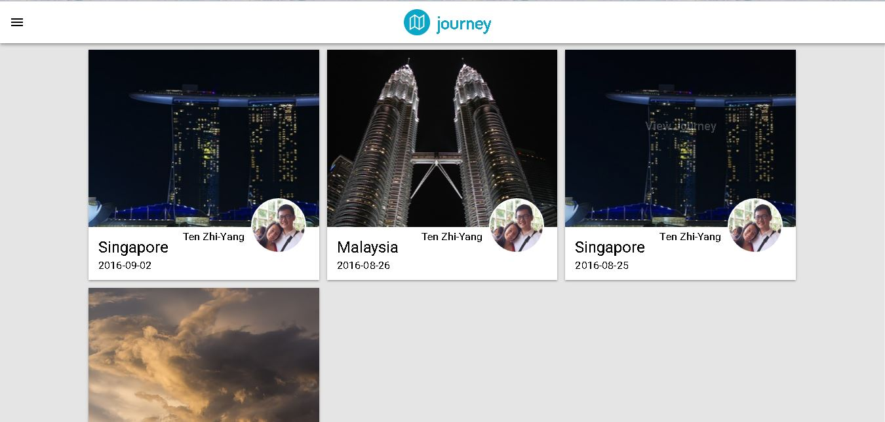
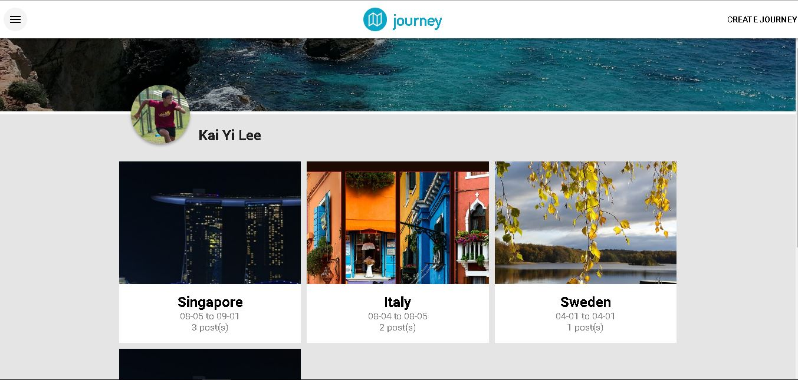

# Journey

Keep up with your friends all over the world!
 
## Introduction

Journey will allow you to see all your friend's trips in one integrated platform, categorized into easy to navigate journeys. See what your friends are doing abroad, without actually being there!

## Screenshots

Start exploring different trips

View your friend's journeys

See your own journeys

## Built With
* [AngularJS](https://angularjs.org/)
* [NodeJS](https://nodejs.org/en/)
* [Postgresql](https://www.postgresql.org/)

## Live site url
[http://journey.ddns.net/](http://journey.ddns.net/)

## Documentation
* [Journey Pitch](reports/group-2-pitch.pdf)
* [Journey Milestones](reports/group-2-milestones.pdf)

## Contributors
- Lee Kai Yi, A0122357L, PM & Documentation, <kaiyi.lee@u.nus.edu>
- Tan Jia Min Michelle, A0112828H, UI Design & Implementation, <michelletanjm@gmail.com>
- Chua Yao Hui, A0097569E, Back-end & Integration, <yaohui.chua@u.yale-nus.edu.sg>
- Ten Zhi-Yang, A0125415N, API Integration & Back-end, <ten.zhiyang@u.nus.edu>
